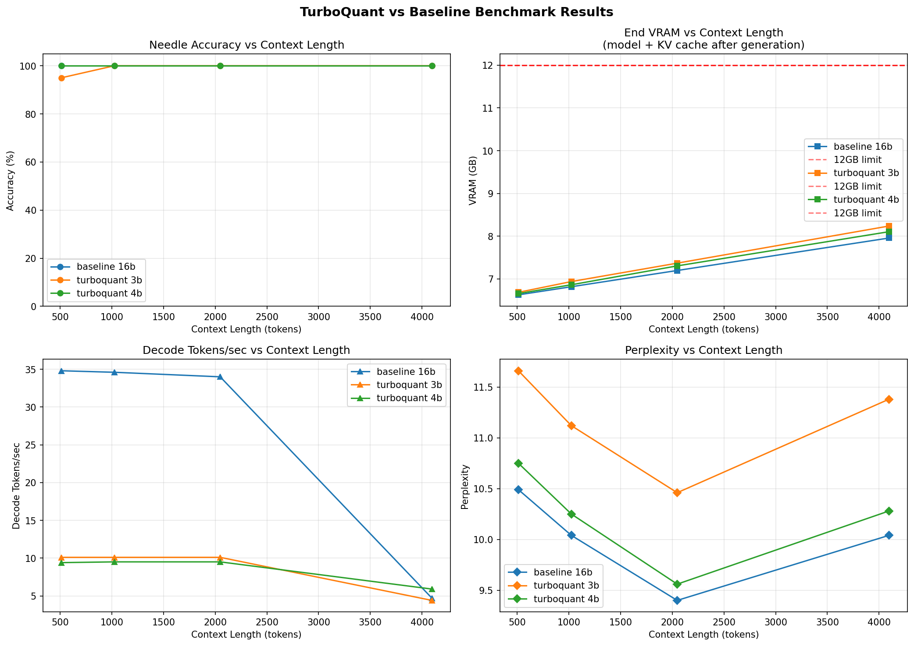

# TurboQuant Implementation & Benchmark

Implementing and benchmarking **TurboQuant** — an online vector quantization algorithm for KV cache compression in LLMs.

**Paper:** [TurboQuant: Online Vector Quantization with Near-optimal Distortion Rate](https://arxiv.org/abs/2504.19874)
**Model:** `meta-llama/Llama-3.2-3B-Instruct` — 28 layers, 8 KV heads (same family as paper)
**GPU:** RTX 5070 12GB

For a plain-English explanation of the paper see [`turboquant_explained.md`](turboquant_explained.md).

---

## What we're implementing

TurboQuant compresses the **stored KV cache** 4× during LLM inference with near-zero quality loss. Core idea: apply a random rotation to KV vectors so their coordinates become approximately Gaussian, then use a precomputed optimal scalar quantizer (Lloyd-Max) to store each coordinate in 3–4 bits instead of 16.

### What TurboQuant does and does not compress

TurboQuant targets **KV cache storage** — the keys and values accumulated across all past tokens during autoregressive generation. It does **not** reduce the memory required for the initial prompt processing (prefill), which is dominated by O(seq²) attention activations and is independent of how the cache is stored.

On a 12 GB GPU this distinction matters: an 8 192-token prefill already overflows VRAM regardless of compression method, so that length is excluded from the benchmark. The correct comparison uses prefill contexts ≤ 4 096 tokens with long generation (512+ new tokens), where the accumulated KV cache becomes the bottleneck.

### Benchmark metrics

| Metric | What it measures |
|---|---|
| `avg_peak_vram_gb` | Peak VRAM during prefill — similar for both modes |
| `avg_end_vram_gb` | VRAM after generation: model + KV cache (activations freed) — **main savings metric** |
| `avg_kv_cache_gb` | Exact size of the compressed cache tensor |
| `avg_decode_tps` | Decode-phase throughput (new tokens per second) |
| `accuracy` | Needle-in-haystack recall — quality preservation check |
| `perplexity` | WikiText-2 perplexity — language quality reference |

The benchmark runs identical tests with and without compression and compares memory, speed, and quality.

---

## Project structure

```
src/
  turboquant.py        # Core algorithm: RHT rotation + Lloyd-Max quantizer
  triton_kernels.py    # Custom Triton GPU kernels (fused quantize+pack, unpack+lookup)
  kv_cache_hook.py     # TurboQuantCache — drop-in replacement for DynamicCache
benchmarks/
  run_benchmark.py     # Benchmark runner (needle, speed, perplexity tests)
  compare_results.py   # Loads JSON logs, prints comparison table + plots
tests/
  test_triton_kernels.py  # Correctness tests + speed benchmark for Triton kernels
logs/                  # JSON output from each run
results/               # Comparison reports and plots
```

---

## Benchmark results — RTX 5070 12GB / Llama-3.2-3B-Instruct



> Generated by running the commands below. Plots show needle accuracy, peak VRAM, tokens/sec, and perplexity across context lengths for baseline (fp16) vs TurboQuant (4-bit and 3-bit).

---

## Triton kernels

`src/triton_kernels.py` provides two custom GPU kernels that replace the hottest paths in `TurboQuantMSE`:

| Kernel | Replaces | Gain |
|---|---|---|
| `turboquant_quantize_and_pack` | `unsqueeze(-1) - centroids` + `argmin` + `pack_indices` loop | Eliminates 16–64 MB intermediate tensor; **~9x faster** |
| `turboquant_unpack_and_lookup` | `unpack_indices` loop + centroid gather | **~5x faster** |

**Combined: 7x faster quantize+dequantize, ~470 MB less VRAM pressure during prefill** (16.8 MB × 28 layers).

The kernels activate automatically when `triton-windows` is installed and a CUDA device is present. 3-bit quantization falls back to the Python path. Verify:

```bash
python -c "import src.turboquant as t; print('Triton active:', t._TRITON_AVAILABLE)"

# Run correctness tests + speed benchmark
python tests/test_triton_kernels.py
```

---

## Quickstart

> **Llama 3.2 requires a HuggingFace token.** Accept the license at
> [huggingface.co/meta-llama/Llama-3.2-3B-Instruct](https://huggingface.co/meta-llama/Llama-3.2-3B-Instruct)
> then set your token before running: `export HF_TOKEN=hf_your_token_here`

```bash
pip install -r requirements.txt

# Validate algorithm correctness (no model needed)
python validate_turboquant.py

# Run baseline (fp16 KV cache)
# context_lengths ≤ 4096 (prefill fits in 12 GB); 512 decode tokens (KV cache grows)
python benchmarks/run_benchmark.py --mode baseline --test all \
    --context_lengths 512 1024 2048 4096 --n_decode_tokens 512

# Run TurboQuant 4-bit compressed KV cache
python benchmarks/run_benchmark.py --mode turboquant --bits 4 --test all \
    --context_lengths 512 1024 2048 4096 --n_decode_tokens 512

# Compare results — end_vram_gb shows the KV cache memory savings
python benchmarks/compare_results.py --auto --save_plots

# Or run the full pipeline in one shot:
bash run_full_benchmark.sh
```
